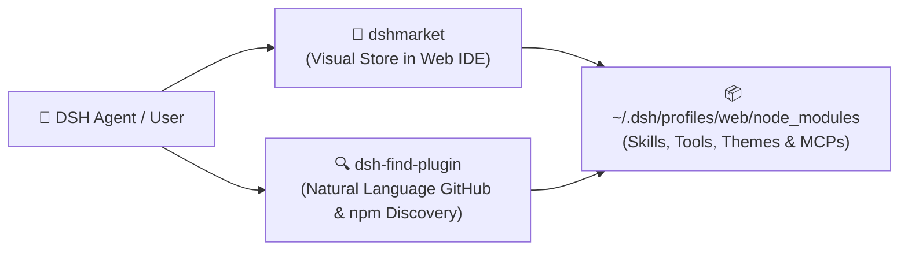
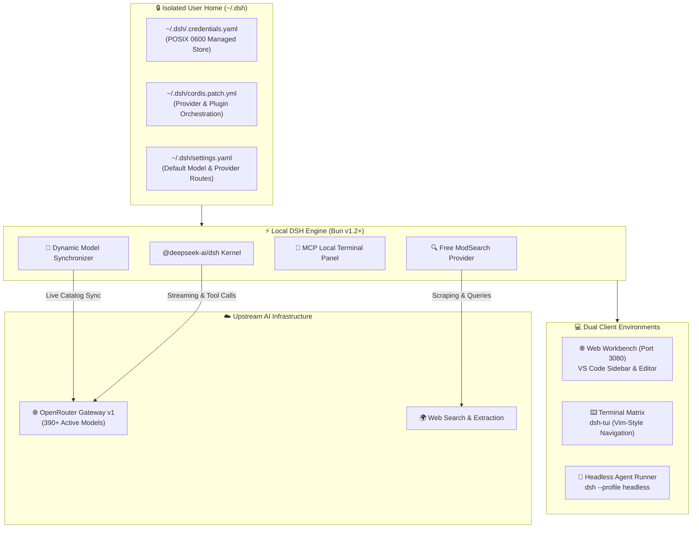

<div align="center">

# ⚡ DeepSeek Harness (DSH)
### *Production-Grade Developer Workspace & Multi-Interface AI Engine*

[](https://bun.sh)
[](https://github.com/deepseek-ai)
[](https://openrouter.ai)
[-06B6D4?style=for-the-badge&logo=searxng&logoColor=white)](https://www.npmjs.com/package/@liustack/modsearch)
[](#-security--sandboxing)
[](#-automated-ci--quality-gates)
[](LICENSE)

<p align="center">
  <b>A blazing-fast, local-first multi-interface AI engineering workbench built on the <a href="https://bun.sh">Bun runtime</a> and <a href="https://github.com/deepseek-ai">DeepSeek Harness</a> framework.</b><br>
  Equipped with dynamic OpenRouter model discovery, free search engines, MCP tooling consoles, and isolated credential stores.
</p>

---

[🚀 Quick Start](#-quick-start-in-60-seconds) • [✨ Key Features](#-core-capabilities) • [🎨 Customization Guide](CUSTOMIZATION.md) • [🛒 Plugin Store](#-everything-is-a-plugin-dshmarket--dsh-find-plugin) • [🔍 Free Search](#-zero-cost-web-search-modsearch) • [🏛️ Architecture](#%EF%B8%8F-system-architecture) • [🩺 Doctor](#-diagnostic-health-check) • [🛡️ Security](#-security--sandboxing)

---

</div>

## ✨ Core Capabilities

| Feature | Description |
| :--- | :--- |
| 🌐 **Universal Gateway** | Stream completions directly from [OpenRouter](https://openrouter.ai) with streaming, tool calling, and multimodal reasoning across **390+ models**. |
| 🛒 **Plugin & Skill Marketplace** | Pre-installed `dshmarket` (GUI Store) and `dsh-find-plugin` (Natural Language Discovery) to add community plugins, tools, and skills on the fly. |
| 🔄 **Live Dynamic Model Sync** | `bun run sync-models` queries OpenRouter's live API to automatically register new frontier models into your runtime patch. |
| 🔍 **Zero-Cost Web Search** | Pre-integrated `@liustack/modsearch` replaces paid search APIs with zero-config multi-engine web search & Firecrawl scraping. |
| 🖥️ **Dual Interface Matrix** | Switch seamlessly between a **VS Code-style browser IDE** (`dsh-better-sidebar`) and a **Vim-inspired terminal matrix** (`dsh-tui`). |
| 🛡️ **Zero-Plaintext Security** | POSIX-isolated managed credential store (`0600` permissions in a `0700` root) with pre-flight API key verification and automatic `.env` purging. |
| 🔌 **Integrated MCP Hub** | Built-in Model Context Protocol panel (`dsh-mcp-panel`) with auto-discovery, trial execution console, and versioned backups. |
| ⚙️ **Models Pro Configurator** | Dedicated Settings UI (`dsh-provider-model-configurator`) to tune context windows, max tokens, sampling parameters, and reasoning budgets. |
| 🩺 **Non-Destructive Doctor** | Instant health diagnostics (`doctor.js`) validating runtime integrity, port bindings, permissions, and network connectivity. |

---

## 🛒 Everything is a Plugin (`dshmarket` & `dsh-find-plugin`)

In the **DeepSeek Harness** architecture, **everything is a plugin** — skills, MCP adapters, UI widgets, LLM providers, and agent loops.

This workspace comes pre-provisioned with both graphical and natural-language plugin management systems:



### 1. Visual Marketplace (`dshmarket`)
* Integrated directly into the Web Workbench UI (`http://127.0.0.1:3080`).
* Browse, install, update, and toggle community plugins and skill packs with a single click.

### 2. Natural-Language Plugin Discovery (`dsh-find-plugin`)
* Ask your agent in natural language to find tools or capabilities during a session:
  > *"Find a plugin for Docker container management"*  
  > *"Search for community plugins that add PostgreSQL skills"*
* The agent queries GitHub topics and npm registries dynamically, presenting installable plugin recommendations.

### 3. CLI Plugin Management
You can also add or remove plugins directly from your terminal per profile:
```bash
# Add a plugin to the web profile
bunx @deepseek-ai/dsh plugin --profile web add <plugin-name>

# Add a tool plugin to the headless profile
bunx @deepseek-ai/dsh plugin --profile headless add <plugin-name>
```

### 4. Profile Capability Matrix

| Capability | 🌐 `bun run web`<br>*(Web Workbench)* | ⌨️ `bun run cli`<br>*(Terminal TUI)* | 🤖 `bun run headless`<br>*(Background Agent)* |
| :--- | :---: | :---: | :---: |
| **Visual Plugin Store (`dshmarket`)** | ✅ Web UI Store | ❌ | ❌ |
| **Visual VSCode Layout (`dsh-better-sidebar`)** | ✅ Browser Workbench | ❌ (Vim-style TUI) | ❌ |
| **Visual MCP Cockpit (`dsh-mcp-panel`)** | ✅ Dedicated Settings UI | ❌ (YAML Config) | ❌ (YAML Config) |
| **Model Pro Configurator** | ✅ Visual UI in Settings | ❌ (YAML Config) | ❌ (YAML Config) |
| **Natural Language Discovery (`dsh-find-plugin`)** | ✅ Available to Agent | ✅ Available in Session | ✅ Available to Headless Agent |
| **Free Search Engine (`@liustack/modsearch`)** | ✅ Enabled | ✅ Enabled | ✅ Enabled |
| **Workspace Skills (`./skills/`)** | ✅ **Global** | ✅ **Global** | ✅ **Global** |
| **OpenRouter 390+ Model Catalog** | ✅ **Global** | ✅ **Global** | ✅ **Global** |
| **POSIX 0600 Credential Isolation** | ✅ **Global** | ✅ **Global** | ✅ **Global** |

---

## 🔍 Zero-Cost Web Search (`@liustack/modsearch`)

Standard AI agent harnesses often rely on expensive search APIs (Tavily, Bing, Google Search API) with separate monthly quotas and rate limits. This workspace integrates **[`@liustack/modsearch`](https://www.npmjs.com/package/@liustack/modsearch)** directly into the runtime profile.

### 🌟 Why `@liustack/modsearch`?
* 🆓 **Zero API Keys & Zero Cost:** Queries the web without requiring any subscription or credit card.
* 🌐 **Multi-Engine Aggregator:** Automatically queries and falls back between DuckDuckGo, Bing, and open web indexers.
* 🕷️ **Clean Web Scraping:** Uses Firecrawl-compatible web extraction to deliver sanitized, readable Markdown directly into the agent's reasoning loop.
* ⚡ **Zero-Code Override:** Pre-configured in `~/.dsh/cordis.patch.yml` to automatically intercept and replace default paid search providers:

```yaml
# Disable default paid search in favor of free ModSearch
- id: web-search-deepseek
  disabled: true

- id: web
  config:
    searchProvider: modsearch
```

---

## 🏛️ System Architecture



---

## 🚀 Quick Start in 60 Seconds

### 1. Prerequisites
Ensure the **Bun Runtime** is installed on your host machine:

```bash
curl -fsSL https://bun.sh/install | bash
```

### 2. Environment Bootstrap (Isolated Local Setup by Default)
Clone the repository and run the setup pipeline:

```bash
git clone https://github.com/hdjebar/deepseek-harness-workspace.git
cd deepseek-harness-workspace
chmod +x setup-dsh.sh

# 📦 Default: Install locally into ./.dsh (100% isolated per workspace)
./setup-dsh.sh

# 🌍 Optional: Install globally into ~/.dsh (shared across projects)
./setup-dsh.sh --global

# 📁 Optional: Install into a custom directory
./setup-dsh.sh --dir /path/to/dsh-config
```

> [!TIP]
> **Local by Default:** Configurations, credentials, and plugins are stored in `./.dsh` (already ignored by `.gitignore`). You can have multiple distinct DSH workspaces on the same machine without any cross-project conflicts!

---

## 💻 Runtime Interfaces & Commands

```bash
# 🌐 1. Launch the VS Code-style Browser Web IDE (http://127.0.0.1:3080)
bun run web

# ⌨️ 2. Launch the High-Performance Keyboard Terminal Matrix
bun run cli

# 🤖 3. Execute a Headless Agent Automation Pipeline
bun run headless "Audit this repository and suggest architecture optimizations"

# 🔄 4. Synchronize Live Models from OpenRouter
bun run sync-models

# 🩺 5. Run the Workspace Health Diagnostic (Detects local vs global target)
bun run doctor

# 🧹 6. Clean Slate Workspace Reset
bun run reset            # Resets local ./.dsh workspace configuration
./reset.sh --global      # Resets global ~/.dsh configuration
```

---

## 🎨 Extensibility & Customization

This workspace is designed to be fully customizable via conversational prompts, DSH plugins, and MCP servers:

* 🛒 **Community Plugins:** Install visual tools, sidebars, and models with 1-click via **`dshmarket`** in the Web UI.
* 🔍 **Natural-Language Discovery:** Ask your agent in chat (*"Find a plugin for Docker / PostgreSQL"*) via **`dsh-find-plugin`**.
* 🧠 **Custom Skills:** Add domain rules anytime by placing Markdown files in `./skills/<skill-name>/SKILL.md`.
* 📖 **Learn More:** Check out the [**Customization Guide (CUSTOMIZATION.md)**](CUSTOMIZATION.md) for practical prompt recipes.

---

## 🩺 Diagnostic Health Check

Run `bun run doctor` anytime for an instant, non-destructive health analysis of your environment:

```
🩺 DSH workspace doctor — read-only diagnostics

✅ Bun runtime — bun 1.3.14
✅ Framework installed — @deepseek-ai/dsh 0.1.1-rc.2
✅ Script bindings — web, cli, headless, sync-models, doctor
✅ OpenRouter key valid — source: ~/.dsh/.credentials.yaml (managed store); limit: no spending limit
✅ Runtime patch layer — /Users/user/.dsh/cordis.patch.yml
✅ Model catalog synced — 396 models in cordis.patch.yml
✅ Sync anchor present
✅ Settings layer — ~/.dsh/settings.yaml routes openrouter
✅ Web profile plugins — 5/5 installed
ℹ️  Port 3080 — free — nothing listening

✅ All critical checks passed.
```

---

## 🛡️ Security & Sandboxing

> [!IMPORTANT]
> **Strict POSIX Credential Isolation**  
> Credentials reside in `~/.dsh/.credentials.yaml` with strict `0600` permissions (readable/writable only by the owner) inside a `0700` directory. Legacy plaintext `.env` copies are automatically expunged on bootstrap.

> [!NOTE]
> **Runtime Filesystem Sandboxing**  
> Agent file mutations are fenced by DSH's native runtime sandbox policies (`read-only`, `workspace-write`, or `danger-full-access`). Dangerous filesystem mutations outside the workspace boundary require explicit user approval.

---

## 🛑 Stopping & Killing Processes

If a background DSH process, web server, or port (`3080`) is locked or lingering:

```bash
# Terminate lingering web server on port 3080
lsof -ti :3080 | xargs kill -9 2>/dev/null || true

# Kill any active DSH background processes
pkill -9 -f "bun.*dsh" 2>/dev/null || pkill -9 -f "dsh-tui" 2>/dev/null || true
```

---

## 🧹 Clean Slate & Reset

To completely reset the workspace, purge stored credentials, and clean local caches:

```bash
# Interactive reset (prompts for confirmation)
./reset.sh
# or via npm/bun script
bun run reset

# Non-interactive force reset (for CI or automation)
./reset.sh --force
```

The reset script safely:
1. Terminates any lingering DSH web servers on port 3080 and background processes.
2. Purges the global `~/.dsh` directory (credentials, profiles, patches).
3. Cleans local untracked `node_modules`, `.dsh/`, and runtime logs.

*To reinstall and configure fresh after reset, simply run `./setup-dsh.sh`.*

---

## ❓ Troubleshooting Matrix

| Issue / Symptom | Root Cause | Solution |
| :--- | :--- | :--- |
| **`HTTP 401 Unauthorized` on inference** | Invalid or revoked OpenRouter key | Check key status with `bun run doctor`, then re-run `./setup-dsh.sh` with a valid key from [openrouter.ai/keys](https://openrouter.ai/keys). |
| **`Port 3080` already in use** | Lingering background DSH web process | Run `lsof -ti :3080 \| xargs kill -9` and relaunch `bun run web`. |
| **Missing models in catalog** | Patch has not been synced recently | Execute `bun run sync-models` to pull real-time OpenRouter models. |
| **"Failed to locate openrouter block anchor"** | `cordis.patch.yml` lost its `# Route default model` anchor | Re-run `./setup-dsh.sh` to regenerate the patch layer. |
| **Plugin installation failure** | Network timeout during initial bootstrap | Re-run `./setup-dsh.sh` (setup is fully idempotent). |

---

## 🧪 Automated CI & Quality Gates

This repository is strictly validated by GitHub Actions ([`.github/workflows/ci.yml`](.github/workflows/ci.yml)):

- 🛡️ **ShellCheck & Syntax Validation:** Rigorous style and syntax enforcement on all bash automation.
- 📦 **Frozen Lockfile Concurrency:** Verification of byte-exact dependencies using `bun install --frozen-lockfile`.
- 🔄 **Idempotent Model Syncing:** Validates that live catalog updates preserve patch integrity without duplication.
- 🩺 **Negative Diagnostic Tests:** Ensures error conditions and missing credentials fail loudly and predictably.
- 📜 **YAML Schema Validation:** Python `pyyaml` validation verifying provider and model block structures.

---

<div align="center">

Made with ⚡ by [Hdjebar](https://github.com/hdjebar) • Powered by [DeepSeek Harness](https://github.com/deepseek-ai) & [Bun](https://bun.sh)

</div>
