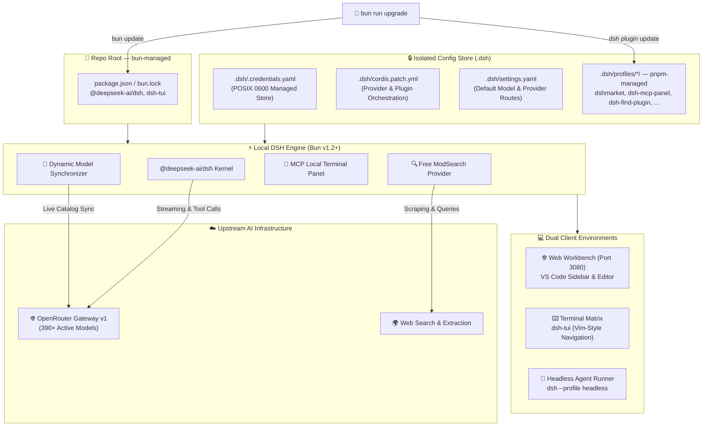

# 🏛️ System Architecture

`.dsh/` resolves to `./.dsh` inside the current workspace by default (local mode — DSH's default) or `~/.dsh` if installed with `./setup-dsh.sh --global`.

**Two disjoint package trees, one command to upgrade both** (see [docs/upgrading.md](upgrading.md)): the repo root is `bun`-managed (`package.json`/`bun.lock`, holding just `@deepseek-ai/dsh` and `dsh-tui`), while every installed plugin lives inside `.dsh/profiles/<name>/`, managed by `pnpm` via its own `pnpm-workspace.yaml`. `bun update` only ever touches the first; `dsh plugin --profile <name> update` only ever touches the second. `bun run upgrade` runs both in sequence, plus the model-catalog sync and a health check.

---

[← Back to README](../README.md)
