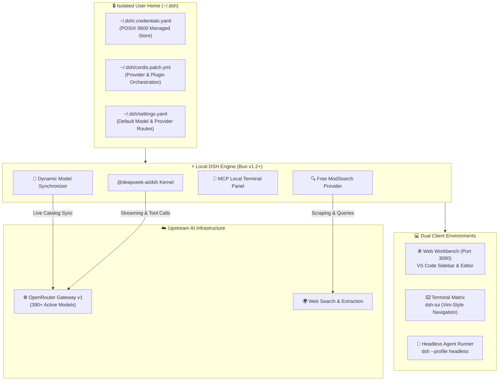

# 🏛️ System Architecture

```mermaid
flowchart TD
    subgraph Storage ["🔒 Isolated User Home (~/.dsh)"]
        CRED["~/.dsh/.credentials.yaml\n(POSIX 0600 Managed Store)"]
        PATCH["~/.dsh/cordis.patch.yml\n(Provider & Plugin Orchestration)"]
        SETT["~/.dsh/settings.yaml\n(Default Model & Provider Routes)"]
    end

    subgraph Interfaces ["💻 Dual Client Environments"]
        WEB["🌐 Web Workbench (Port 3080)\nVS Code Sidebar & Editor"]
        CLI["⌨️ Terminal Matrix\ndsh-tui (Vim-Style Navigation)"]
        HEADLESS["🤖 Headless Agent Runner\ndsh --profile headless"]
    end

    subgraph Runtime ["⚡ Local DSH Engine (Bun v1.2+)"]
        CORE["@deepseek-ai/dsh Kernel"]
        MODSEARCH["🔍 Free ModSearch Provider"]
        MCP["🔌 MCP Local Terminal Panel"]
        SYNC["🔄 Dynamic Model Synchronizer"]
    end

    subgraph Remote ["☁️ Upstream AI Infrastructure"]
        OR["🌐 OpenRouter Gateway v1\n(390+ Active Models)"]
        WEB_NET["🌍 Web Search & Extraction"]
    end

    Storage --> Runtime
    Runtime --> Interfaces
    SYNC -->|Live Catalog Sync| OR
    CORE -->|Streaming & Tool Calls| OR
    MODSEARCH -->|Scraping & Queries| WEB_NET
```

---

[← Back to README](../README.md)
