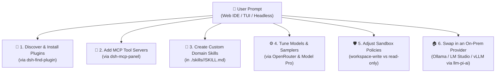

# 🎨 Customizing Your DeepSeek Harness (DSH) Workspace via Prompts

This guide explains how to customize, extend, and tailor your **DeepSeek Harness** workspace **directly through conversational prompts** during chat sessions (in `bun run web`, `bun run cli`, or `bun run headless`).

---

## 🧭 Overview of Customization Layers



---

## 1. 🔌 Discovering & Installing Plugins via Prompts

Because this workspace includes **`dsh-find-plugin`**, you can prompt your agent to find and install community plugins dynamically:

### Example Prompts:
> 💬 *"Find and install a community plugin for Docker container management."*  
> 💬 *"Search for DSH plugins that provide PostgreSQL schema inspection tools."*  
> 💬 *"Find plugins related to Kubernetes or Helm deployments on GitHub/npm."*

### What Happens:
1. The agent queries GitHub topics and npm registries for verified DSH/Cordis plugins.
2. The agent presents installation options and runs `bunx @deepseek-ai/dsh plugin add <plugin-name>` upon your approval.

---

## 2. 🔌 Connecting Model Context Protocol (MCP) Servers

Through **`dsh-mcp-panel`**, you can prompt the agent to configure and register local or remote MCP servers:

### Example Prompts:
> 💬 *"Add a local SQLite MCP server pointing to `./data.sqlite` in my MCP panel config."*  
> 💬 *"Configure the GitHub MCP server so you can inspect PRs and issues."*  
> 💬 *"Connect a Chrome DevTools MCP server for automated browser testing."*

### Manual Configuration Shortcut (`~/.dsh/cordis.patch.yml`):
```yaml
- id: mcp-panel
  config:
    servers:
      sqlite-db:
        command: "npx"
        args: ["-y", "@modelcontextprotocol/server-sqlite", "--db-path", "./data.db"]
      github:
        command: "npx"
        args: ["-y", "@modelcontextprotocol/server-github"]
        env:
          GITHUB_PERSONAL_ACCESS_TOKEN: "${GITHUB_TOKEN}"
```

---

## 3. 🧠 Creating & Teaching Domain Skills via Prompts

Skills in DSH are modular Markdown documents located in `./skills/<skill-name>/SKILL.md`. You can ask the agent to create new specialized skills on the fly:

### Example Prompts:
> 💬 *"Create a new skill in `./skills/nextjs-best-practices/SKILL.md` with rules for App Router, server components, and SEO optimization."*  
> 💬 *"Document our team's GraphQL schema conventions into `./skills/graphql-standards/SKILL.md`."*  
> 💬 *"Generate a security review skill in `./skills/smart-contract-audit/SKILL.md` with common Solidity vulnerability checklists."*

### Skill Structure Template:
```markdown
---
name: my-custom-skill
description: When and how the agent should activate and use this skill.
---

# Skill Title

## Guidelines & Rules
1. First rule...
2. Second rule...

## Examples & Code Patterns
```

---

## 4. ⚙️ Model Selection & Temperature Tuning

With OpenRouter's dynamic gateway (390+ models), you can switch models or adjust reasoning parameters:

### Example Prompts:
> 💬 *"Switch the active model to `deepseek/deepseek-r1` for complex mathematical or architectural reasoning."*  
> 💬 *"Use `anthropic/claude-3.7-sonnet` for this frontend refactoring task."*  
> 💬 *"Set temperature to 0.0 for strict deterministic code auditing."*

### Where Configurations Live:
* **Settings:** `./.dsh/settings.yaml` (or `~/.dsh/settings.yaml` in global mode)
* **Runtime Patch:** `./.dsh/cordis.patch.yml` (or `~/.dsh/cordis.patch.yml` in global mode)
* **Model Pro UI:** Accessible directly under `Settings -> Model Pro` in the Web IDE (`http://127.0.0.1:3080`).

---

## 5. 🛡️ Filesystem Sandboxing & Safety

DSH includes a runtime filesystem sandbox. You can direct the agent on how cautiously to operate:

### Sandbox Modes:
* **`read-only`**: Agent can only inspect files; no modifications allowed.
* **`workspace-write`** *(Default)*: Agent can only write/edit files inside the current repository.
* **`danger-full-access`**: Unrestricted filesystem access (gated behind interactive user approval).

### Example Prompts:
> 💬 *"Operate strictly within `./src` and do not modify root build scripts without asking."*  
> 💬 *"Audit the codebase in read-only mode and present findings before changing any files."*

---

## 6. 🤖 Prompting Headless Agent Pipelines

For CI/CD or overnight background batch processing, pass instructions directly to the headless runner:

```bash
# Complex Codebase Optimization
bun run headless "Analyze the entire codebase, run bun test, fix any failing tests, and write a summary in walkthrough.md"

# Dependency & Security Audit
bun run headless "Inspect package.json and bun.lock for outdated dependencies and generate a report in AUDIT.md"

# Automated Feature Implementation
bun run headless "Implement a dark-mode toggle for the navbar in src/components/Navbar.tsx and verify with unit tests"
```

---

## 7. 🌐 Multi-Workspace & Port Customization

If you are running multiple DSH workspaces concurrently on the same host, use **`DSH_PORT`** to avoid port collisions:

```bash
# Workspace 1 (Runs on standard port 3080)
bun run web

# Workspace 2 (Runs on isolated port 3081)
DSH_PORT=3081 bun run web
DSH_PORT=3081 bun run cli
DSH_PORT=3081 bun run doctor
```

---

## 8. 🏠 Going Local: Switching to an On-Premises AI Provider

### The tradeoff
By default, DSH routes every prompt through [OpenRouter](https://openrouter.ai) — that's what gives you one key and 390+ models, but it also means your prompts leave your machine and go through a third-party gateway. If "personal AI environment" means *private*, not just *isolated per-project*, you'll want inference that never leaves your network.

### Why this is straightforward in DSH
Because **everything is a plugin**, the model provider isn't hardcoded — it's just configuration on the `llm-pi-ai` Cordis plugin. OpenRouter is registered as one entry in a `providers` map, using a generic OpenAI-compatible protocol (`api: openai-completions`) and a `baseURL`. Any local inference server that speaks the same OpenAI-compatible API — [Ollama](https://ollama.com), [LM Studio](https://lmstudio.ai), [vLLM](https://github.com/vllm-project/vllm), or [llama.cpp server](https://github.com/ggml-org/llama.cpp) — can be registered exactly the same way, side-by-side with OpenRouter, and selected as the active model with a one-line config change (or a prompt).

### Example Prompts:
> 💬 *"Add a local Ollama provider pointing to `http://localhost:11434/v1` serving `llama3.1`, and switch the default model to it."*  
> 💬 *"Register my LM Studio server as a provider and let me pick between it and OpenRouter from Model Pro."*

### Manual Configuration (`~/.dsh/cordis.patch.yml`):
```yaml
- id: llm-pi-ai
  config:
    providers:
      openrouter:
        apiKeyEnv: OPENROUTER_API_KEY
        displayName: "OpenRouter"
        api: openai-completions
        baseURL: "https://openrouter.ai/api/v1"
      # 🏠 Add a local, on-premises provider alongside it
      ollama-local:
        apiKeyEnv: OLLAMA_API_KEY   # most local servers ignore this; set any placeholder value
        displayName: "Ollama (Local)"
        api: openai-completions
        baseURL: "http://localhost:11434/v1"

# Point the default model at your local server instead of OpenRouter
- id: agent-default-model
  config:
    provider: ollama-local
    model: llama3.1
```

| Local server | Typical OpenAI-compatible `baseURL` |
| :--- | :--- |
| **Ollama** | `http://localhost:11434/v1` |
| **LM Studio** | `http://localhost:1234/v1` |
| **vLLM** | `http://localhost:8000/v1` |
| **llama.cpp server** | `http://localhost:8080/v1` |

### Notes:
* Since `apiKeyEnv` still resolves through the same managed credential store, add a placeholder value with `bun run doctor`'s companion setup or by hand-editing `.credentials.yaml` (`chmod 600`) — most local servers accept any non-empty key.
* Both providers can stay registered at once; switch between them per-task from the **Model Pro UI** (`dsh-provider-model-configurator`) or by editing `agent-default-model` — no reinstall required.
* Going local only covers *inference*. `@liustack/modsearch` (web search) and any MCP servers you've added still reach the network unless you point them at self-hosted equivalents too.

---

## 📚 Quick Reference Summary

| Goal | Method | Location / Command |
| :--- | :--- | :--- |
| **Add Plugins** | Prompt agent or use GUI Store | `dshmarket` in Web UI / `dsh-find-plugin` |
| **Add MCP Servers** | Prompt agent or edit YAML | `dsh-mcp-panel` / `./.dsh/cordis.patch.yml` |
| **Add Skills** | Prompt agent to write Markdown | `./skills/<name>/SKILL.md` |
| **Go Local (On-Prem AI)** | Register an OpenAI-compatible local server as a provider | `llm-pi-ai.config.providers` in `./.dsh/cordis.patch.yml` |
| **Custom Port** | Set environment variable | `DSH_PORT=3081 bun run web` |
| **Sync Models** | Run sync command | `bun run sync-models` |
| **Check Health** | Run diagnostic | `bun run doctor` |
| **Reset Local Config** | Clean workspace setup | `bun run reset` |
| **Reset Global Config** | Clean global setup | `./reset.sh --global` |

---

[← Back to README](../README.md)
