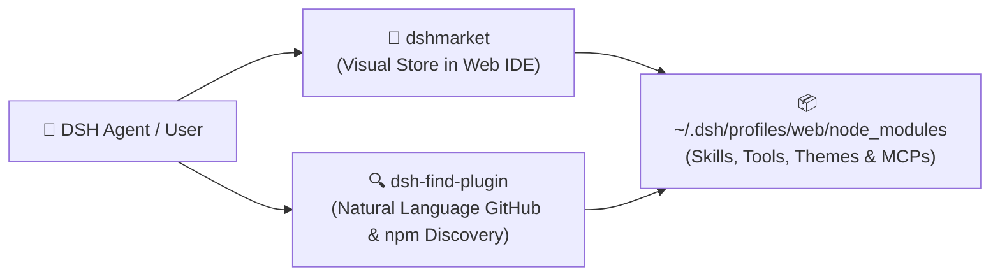

# 🛒 Everything is a Plugin (`dshmarket` & `dsh-find-plugin`)

In the **DeepSeek Harness** architecture, **everything is a plugin** — skills, MCP adapters, UI widgets, LLM providers, and agent loops.

This workspace comes pre-provisioned with both graphical and natural-language plugin management systems:



### 1. Visual Marketplace (`dshmarket`)
* Integrated directly into the Web Workbench UI (`http://127.0.0.1:3080`).
* Browse, install, update, and toggle community plugins and skill packs with a single click.

### 2. Natural-Language Plugin Discovery (`dsh-find-plugin`)
* Ask your agent in natural language to find tools or capabilities during a session:
  > *"Find a plugin for Docker container management"*  
  > *"Search for community plugins that add PostgreSQL skills"*
* The agent queries GitHub topics and npm registries dynamically, presenting installable plugin recommendations.

### 3. CLI Plugin Management
You can also add or remove plugins directly from your terminal per profile:
```bash
# Add a plugin to the web profile
bunx @deepseek-ai/dsh plugin --profile web add <plugin-name>

# Add a tool plugin to the headless profile
bunx @deepseek-ai/dsh plugin --profile headless add <plugin-name>
```

### 4. Profile Capability Matrix

| Capability | 🌐 `bun run web`<br>*(Web Workbench)* | ⌨️ `bun run cli`<br>*(Terminal TUI)* | 🤖 `bun run headless`<br>*(Background Agent)* |
| :--- | :---: | :---: | :---: |
| **Visual Plugin Store (`dshmarket`)** | ✅ Web UI Store | ❌ | ❌ |
| **Visual VSCode Layout (`dsh-better-sidebar`)** | ✅ Browser Workbench | ❌ (Vim-style TUI) | ❌ |
| **Visual MCP Cockpit (`dsh-mcp-panel`)** | ✅ Dedicated Settings UI | ❌ (YAML Config) | ❌ (YAML Config) |
| **Model Pro Configurator** | ✅ Visual UI in Settings | ❌ (YAML Config) | ❌ (YAML Config) |
| **Natural Language Discovery (`dsh-find-plugin`)** | ✅ Available to Agent | ✅ Available in Session | ✅ Available to Headless Agent |
| **Free Search Engine (`@liustack/modsearch`)** | ✅ Enabled | ✅ Enabled | ✅ Enabled |
| **Workspace Skills (`./skills/`)** | ✅ **Global** | ✅ **Global** | ✅ **Global** |
| **OpenRouter 390+ Model Catalog** | ✅ **Global** | ✅ **Global** | ✅ **Global** |
| **POSIX 0600 Credential Isolation** | ✅ **Global** | ✅ **Global** | ✅ **Global** |

---

[← Back to README](../README.md)
